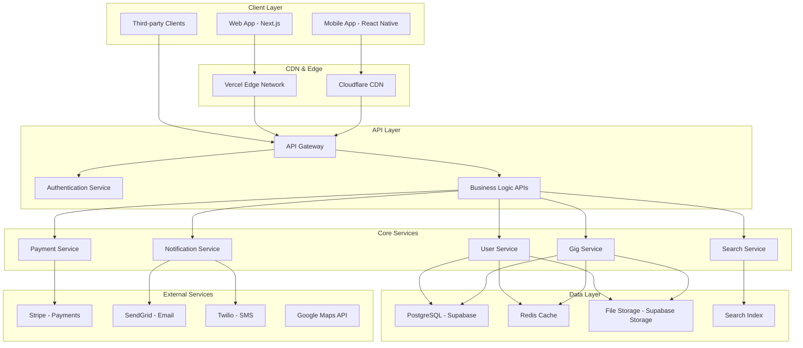
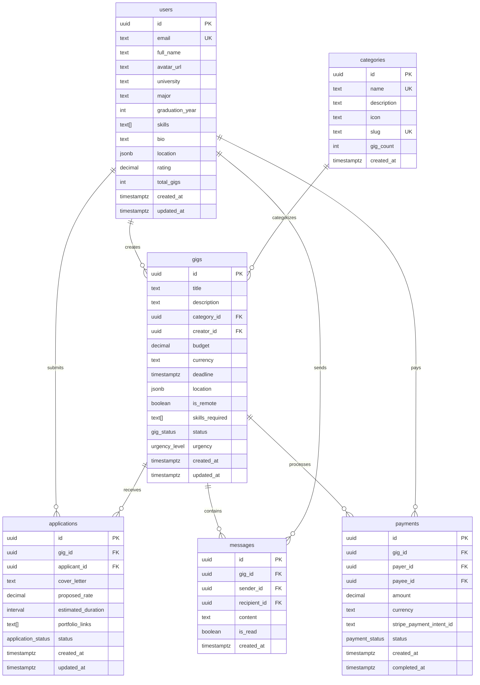
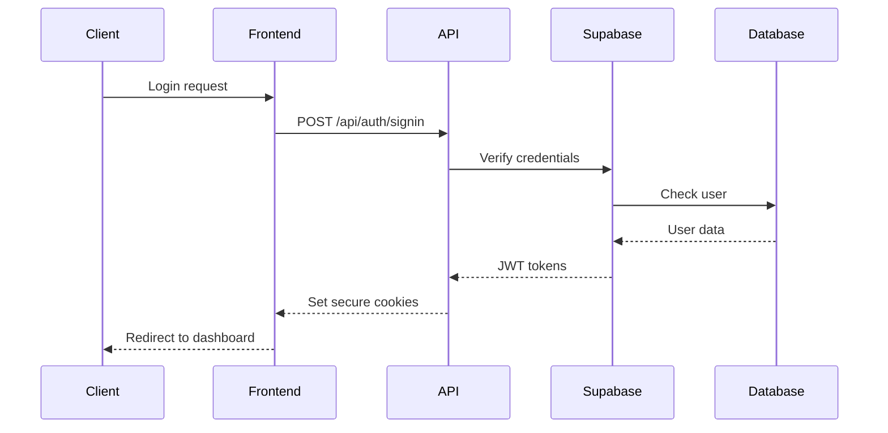
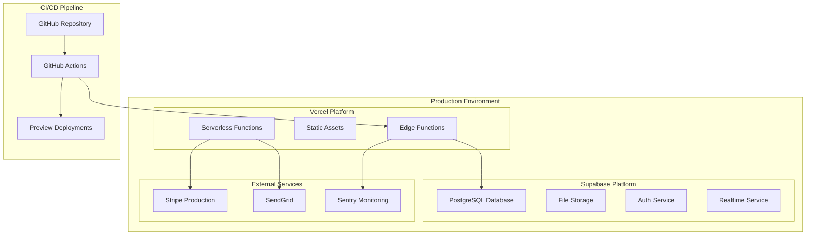

# Architecture Overview

This document provides a comprehensive overview of GigSync's system architecture, design principles, and technical decisions.

## 📋 Table of Contents

- [System Overview](#system-overview)
- [Architecture Principles](#architecture-principles)
- [High-Level Architecture](#high-level-architecture)
- [Frontend Architecture](#frontend-architecture)
- [Backend Architecture](#backend-architecture)
- [Database Design](#database-design)
- [Security Architecture](#security-architecture)
- [Scalability & Performance](#scalability--performance)
- [Deployment Architecture](#deployment-architecture)
- [Monitoring & Observability](#monitoring--observability)

## 🌟 System Overview

GigSync is a modern, cloud-native gig-sharing platform built with a focus on scalability, security, and user experience. The system follows a jamstack architecture with a React-based frontend and serverless backend services.

### Core Requirements
- **Scalability**: Handle thousands of concurrent users
- **Performance**: Sub-second page loads, real-time features
- **Security**: Enterprise-grade security for payments and data
- **Reliability**: 99.9% uptime SLA
- **Maintainability**: Clean, modular, well-documented code

## 🏗️ Architecture Principles

### 1. **Separation of Concerns**
- Clear boundaries between UI, business logic, and data layers
- Domain-driven design for business logic organization
- Single responsibility principle throughout the codebase

### 2. **Scalability First**
- Horizontal scaling capabilities
- Stateless service design
- Efficient caching strategies
- Database optimization for performance

### 3. **Security by Design**
- Zero-trust security model
- Encryption at rest and in transit
- Comprehensive input validation
- Regular security audits and updates

### 4. **Developer Experience**
- Type-safe development with TypeScript
- Comprehensive testing coverage
- Clear documentation and examples
- Automated development workflows

## 🎯 High-Level Architecture



## 🖥️ Frontend Architecture

### Technology Stack
- **Framework**: Next.js 14 with App Router
- **Language**: TypeScript
- **Styling**: Tailwind CSS + Shadcn/ui
- **State Management**: Zustand
- **Forms**: React Hook Form + Zod
- **HTTP Client**: Fetch API with custom hooks
- **Testing**: Jest + React Testing Library + Playwright

### Component Architecture

```
src/
├── app/                    # Next.js 14 App Router
│   ├── (auth)/            # Authentication routes
│   ├── (dashboard)/       # Dashboard routes
│   ├── (public)/          # Public routes
│   └── api/               # API routes
├── components/
│   ├── ui/                # Base UI components (shadcn/ui)
│   │   ├── button.tsx
│   │   ├── input.tsx
│   │   └── ...
│   ├── forms/             # Form components
│   │   ├── gig-form.tsx
│   │   └── profile-form.tsx
│   ├── layout/            # Layout components
│   │   ├── header.tsx
│   │   ├── sidebar.tsx
│   │   └── footer.tsx
│   └── features/          # Feature-specific components
│       ├── gigs/
│       ├── users/
│       └── payments/
├── hooks/                 # Custom React hooks
├── stores/                # Zustand stores
├── lib/                   # Utility libraries
└── types/                 # TypeScript definitions
```

### State Management Strategy

```typescript
// Global state with Zustand
interface AuthStore {
  user: User | null;
  session: Session | null;
  signIn: (credentials: SignInData) => Promise<void>;
  signOut: () => Promise<void>;
}

interface GigsStore {
  gigs: Gig[];
  filters: GigFilters;
  loading: boolean;
  fetchGigs: () => Promise<void>;
  createGig: (data: CreateGigData) => Promise<void>;
}
```

### Performance Optimizations
- **Code Splitting**: Route-based and component-based splitting
- **Image Optimization**: Next.js Image component with WebP
- **Caching**: SWR for data fetching with cache invalidation
- **Bundle Analysis**: Regular bundle size monitoring
- **Core Web Vitals**: Performance monitoring and optimization

## ⚙️ Backend Architecture

### Serverless Architecture
GigSync uses a serverless-first approach with Next.js API routes and Supabase backend services.

```typescript
// API Route Structure
app/api/
├── auth/
│   ├── signin/route.ts
│   ├── signup/route.ts
│   └── refresh/route.ts
├── users/
│   ├── profile/route.ts
│   └── [id]/route.ts
├── gigs/
│   ├── route.ts
│   ├── [id]/route.ts
│   └── [id]/apply/route.ts
├── payments/
│   ├── intent/route.ts
│   └── webhook/route.ts
└── webhooks/
    └── stripe/route.ts
```

### Service Layer Pattern

```typescript
// Domain Services
class GigService {
  constructor(
    private db: Database,
    private cache: CacheService,
    private notifications: NotificationService
  ) {}

  async createGig(data: CreateGigData, userId: string): Promise<Gig> {
    // Validation
    const validated = createGigSchema.parse(data);
    
    // Business logic
    const gig = await this.db.gigs.create({
      ...validated,
      creator_id: userId,
      status: 'open'
    });
    
    // Cache invalidation
    await this.cache.invalidate(`user:${userId}:gigs`);
    
    // Notifications
    await this.notifications.notifyGigCreated(gig);
    
    return gig;
  }
}
```

### API Middleware Stack

```typescript
// Middleware chain
export async function middleware(request: NextRequest) {
  // 1. Security headers
  const response = addSecurityHeaders(request);
  
  // 2. Rate limiting
  await rateLimitMiddleware(request);
  
  // 3. Authentication
  await authMiddleware(request);
  
  // 4. Authorization
  await authzMiddleware(request);
  
  // 5. Request validation
  await validationMiddleware(request);
  
  return response;
}
```

## 🗄️ Database Design

### Schema Overview



### Indexing Strategy

```sql
-- Performance indexes
CREATE INDEX CONCURRENTLY idx_gigs_search 
ON gigs USING gin(to_tsvector('english', title || ' ' || description));

CREATE INDEX CONCURRENTLY idx_gigs_location 
ON gigs USING gist((location->>'coordinates')::point);

CREATE INDEX CONCURRENTLY idx_gigs_category_status 
ON gigs(category_id, status) WHERE status = 'open';

CREATE INDEX CONCURRENTLY idx_gigs_created_at 
ON gigs(created_at DESC);

CREATE INDEX CONCURRENTLY idx_applications_gig_status 
ON applications(gig_id, status);

CREATE INDEX CONCURRENTLY idx_messages_gig_unread 
ON messages(gig_id, is_read) WHERE is_read = false;
```

### Data Partitioning
```sql
-- Partition messages by month for performance
CREATE TABLE messages_y2024m01 PARTITION OF messages
FOR VALUES FROM ('2024-01-01') TO ('2024-02-01');

-- Partition payments by year
CREATE TABLE payments_y2024 PARTITION OF payments
FOR VALUES FROM ('2024-01-01') TO ('2025-01-01');
```

## 🔒 Security Architecture

### Authentication Flow



### Security Layers

#### 1. **Network Security**
- HTTPS everywhere with TLS 1.3
- CORS policies for API endpoints
- CSP headers for XSS protection
- Rate limiting per IP/user

#### 2. **Authentication Security**
- JWT tokens with short expiration
- Refresh token rotation
- Secure cookie settings
- Session management

#### 3. **Authorization**
- Role-based access control (RBAC)
- Resource-level permissions
- API endpoint protection
- Database row-level security (RLS)

#### 4. **Data Security**
- Input validation and sanitization
- SQL injection prevention
- Encryption at rest (AES-256)
- PII data protection

### Row-Level Security (RLS)

```sql
-- Users can only access their own data
CREATE POLICY user_select_own ON users
FOR SELECT USING (auth.uid() = id);

-- Gig creators can update their gigs
CREATE POLICY gig_update_creator ON gigs
FOR UPDATE USING (auth.uid() = creator_id);

-- Users can only see applications for their gigs or their own applications
CREATE POLICY application_select_policy ON applications
FOR SELECT USING (
  auth.uid() = applicant_id OR 
  auth.uid() IN (SELECT creator_id FROM gigs WHERE id = gig_id)
);
```

## 📈 Scalability & Performance

### Horizontal Scaling Strategy

#### Frontend Scaling
- **CDN Distribution**: Global edge network via Vercel
- **Static Generation**: Pre-built pages for better performance
- **Code Splitting**: Lazy loading of route components
- **Image Optimization**: Next.js Image component with optimization

#### Backend Scaling
- **Serverless Functions**: Auto-scaling Next.js API routes
- **Database Scaling**: Supabase connection pooling
- **Caching Layer**: Redis for session and query caching
- **Search Optimization**: Elasticsearch for full-text search

### Performance Monitoring

```typescript
// Performance metrics collection
export function trackPerformance(action: string, duration: number) {
  analytics.track('Performance', {
    action,
    duration,
    page: window.location.pathname,
    user_agent: navigator.userAgent
  });
}

// Core Web Vitals monitoring
import { getCLS, getFID, getFCP, getLCP, getTTFB } from 'web-vitals';

getCLS(console.log);
getFID(console.log);
getFCP(console.log);
getLCP(console.log);
getTTFB(console.log);
```

### Caching Strategy

```typescript
// Multi-layer caching
class CacheService {
  // Level 1: Browser cache
  async getBrowserCache(key: string) {
    return localStorage.getItem(key);
  }
  
  // Level 2: CDN cache (Vercel)
  async getCDNCache(url: string) {
    return fetch(url, { next: { revalidate: 3600 } });
  }
  
  // Level 3: Application cache (Redis)
  async getAppCache(key: string) {
    return redis.get(key);
  }
  
  // Level 4: Database query cache
  async getQueryCache(query: string) {
    return supabase.rpc('cached_query', { sql: query });
  }
}
```

## 🚀 Deployment Architecture

### Infrastructure Overview



### Deployment Pipeline

```yaml
# .github/workflows/deploy.yml
name: Deploy to Production

on:
  push:
    branches: [main]

jobs:
  test:
    runs-on: ubuntu-latest
    steps:
      - uses: actions/checkout@v3
      - name: Setup Node.js
        uses: actions/setup-node@v3
        with:
          node-version: '18'
      - name: Install dependencies
        run: npm ci
      - name: Run tests
        run: npm run test:ci
      - name: Run type check
        run: npm run type-check
      - name: Run linting
        run: npm run lint

  deploy:
    needs: test
    runs-on: ubuntu-latest
    steps:
      - uses: actions/checkout@v3
      - name: Deploy to Vercel
        uses: vercel/action@v1
        with:
          vercel-token: ${{ secrets.VERCEL_TOKEN }}
          vercel-org-id: ${{ secrets.ORG_ID }}
          vercel-project-id: ${{ secrets.PROJECT_ID }}
```

### Environment Configuration

| Environment | Purpose | Database | Domain |
|-------------|---------|----------|--------|
| Development | Local development | Local Supabase | localhost:3000 |
| Preview | Feature testing | Staging database | preview-*.vercel.app |
| Staging | Pre-production | Staging database | staging.gigsync.app |
| Production | Live application | Production database | gigsync.app |

## 📊 Monitoring & Observability

### Monitoring Stack
- **Application Monitoring**: Sentry for error tracking
- **Performance Monitoring**: Vercel Analytics
- **Infrastructure Monitoring**: Supabase Dashboard
- **User Analytics**: Custom analytics with privacy focus

### Alerting Strategy

```typescript
// Error tracking and alerting
import * as Sentry from '@sentry/nextjs';

Sentry.init({
  dsn: process.env.NEXT_PUBLIC_SENTRY_DSN,
  environment: process.env.NODE_ENV,
  beforeSend(event) {
    // Filter out sensitive data
    if (event.request?.headers?.authorization) {
      delete event.request.headers.authorization;
    }
    return event;
  }
});

// Custom metrics
export function trackBusinessMetric(metric: string, value: number) {
  Sentry.addBreadcrumb({
    message: `Business metric: ${metric}`,
    data: { value },
    level: 'info'
  });
}
```

### Health Checks

```typescript
// API health check endpoint
export async function GET() {
  const health = {
    status: 'healthy',
    timestamp: new Date().toISOString(),
    version: process.env.APP_VERSION,
    checks: {
      database: await checkDatabase(),
      cache: await checkCache(),
      external_apis: await checkExternalAPIs()
    }
  };
  
  const isHealthy = Object.values(health.checks).every(check => check.status === 'ok');
  
  return Response.json(health, { 
    status: isHealthy ? 200 : 503 
  });
}
```

## 🔮 Future Architecture Considerations

### Microservices Migration
As the platform grows, consider migrating to microservices:
- User Service
- Gig Service  
- Payment Service
- Notification Service
- Search Service

### Event-Driven Architecture
Implement event sourcing for better scalability:
- User events (registration, profile updates)
- Gig events (creation, application, completion)
- Payment events (initiated, completed, failed)

### Advanced Search
Enhance search capabilities:
- Vector search for semantic matching
- ML-based recommendations
- Real-time indexing with Elasticsearch

---

This architecture provides a solid foundation for GigSync's current needs while allowing for future growth and scalability. The design emphasizes developer productivity, system reliability, and user experience. 🚀